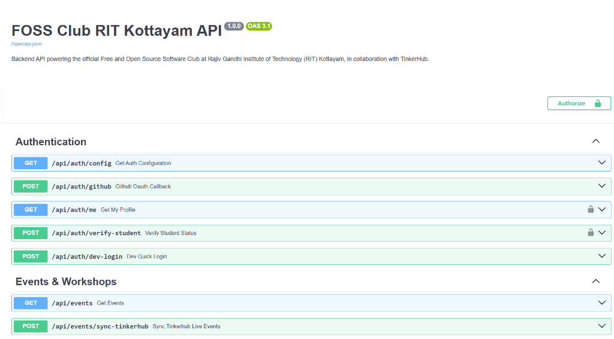

# FOSS Club — RIT Kottayam

The official web platform and community portal for the Free and Open Source Software (FOSS) Club at Rajiv Gandhi Institute of Technology (RIT), Government Engineering College, Kottayam — built in active collaboration with the [TinkerHub Foundation](https://tinkerhub.org) (Campus Chapter 2160).

**Motto:** *Learn. Share. Contribute.*


---

## Overview

The platform serves as the central hub for open-source engineering culture at RIT Kottayam. It facilitates student onboarding, showcases campus-built open-source repositories, and synchronizes live workshops and hackathons conducted with TinkerHub.

### Core Capabilities

- **Live Campus Event Synchronization:** Automatically scrapes and parses live workshop schedules, venue details, and registration links directly from the [TinkerHub RIT Campus Portal](https://tinkerhub.org/campus/2160/Rajiv%20Gandhi%20Institute%20of%20Technology,%20Velloor) with resilient 10-minute in-memory caching and automatic retries.
- **Authenticated Project Showcase:** Students can feature open-source projects built on campus. The backend automatically queries GitHub's API to extract live metrics (stars, forks, open issues, language tags) and verifies repository authorship to prevent spoofed submissions.
- **Anti-Spam & Submission Cap:** Enforces a strict limit of 3 featured repositories per student account, automatically rejects unedited forks, requires public descriptions, and blocks archived repositories.
- **GitHub OAuth & Student Verification:** Frictionless 1-click GitHub authentication paired with `@rit.ac.in` college email verification that awards a verified student badge on project cards.
- **Slim Horizontal Repository Cards:** Information-dense repository rows displaying live GitHub author avatars, direct GitHub profile links, and live telemetry.
- **Builder Personas & Terminal Tips:** Four selectable campus builder personas (Happy Hacker, Systems Master, Vibe Coder, Kernel Debugger) with dynamic theme accent glow toggling and curated FOSS engineering tips.
- **Resilient Dual-Engine Database:** SQLAlchemy 2.0 database layer that connects directly to PostgreSQL (Supabase, Neon, or self-hosted) in production, with an automatic zero-configuration SQLite fallback for local development.

---

## Tech Stack

| Layer | Technologies |
| :--- | :--- |
| **Frontend** | React 18, TypeScript 5, Vite 5, React Router 6, Lucide Icons, Pure CSS Tokens |
| **Backend** | Python 3.10+, FastAPI, Uvicorn, Pydantic v2, HTTPX |
| **Authentication** | GitHub OAuth 2.0, Python-Jose (JWT / HS256) |
| **Database** | PostgreSQL (Supabase) / SQLite fallback via SQLAlchemy 2.0 ORM |
| **Styling** | Vanilla CSS with custom design tokens, dark/light theme support, and responsive layouts |

---

## Architecture & Directory Structure

```
foss-club-website/
├── backend/
│   ├── core/                    # Application settings, environment loading & JWT security
│   │   ├── config.py            # Typed settings (DATABASE_URL, OAuth keys, secrets)
│   │   └── security.py          # JWT generation, token decoding & auth dependencies
│   ├── db/                      # Database engine, connection pooling & ORM models
│   │   ├── session.py           # SQLAlchemy engine (PostgreSQL/Supabase + SQLite fallback)
│   │   └── models.py            # Database tables (UserDB, ProjectDB, MemberDB, EventRSVPDB)
│   ├── schemas/                 # Pydantic validation & response schemas
│   │   ├── auth.py              # UserPublic, AuthResponse, VerifyStudentEmail
│   │   ├── project.py           # Project (with is_verified_student), ProjectCreate
│   │   ├── member.py            # MemberPublic, ClubStats
│   │   └── event.py             # Event, EventRSVP, RSVPResponse
│   ├── routers/                 # API route handlers
│   │   ├── auth.py              # /api/auth endpoints (OAuth config, tokens, verify-student)
│   │   ├── events.py            # /api/events endpoints (live campus sync & RSVPs)
│   │   ├── projects.py          # /api/projects endpoints (with 3-project cap & author checks)
│   │   └── members.py           # /api/members endpoints (community roster & live stats)
│   ├── services/                # External integration logic
│   │   ├── github_service.py    # GitHub API scraper, repo sanity checks & contributor validation
│   │   └── tinkerhub_service.py # Live Nuxt 3 SSR scraper for RIT Campus (2160)
│   ├── main.py                  # FastAPI application entrypoint & middleware configuration
│   └── requirements.txt         # Python dependencies
│
└── frontend/
    ├── src/
    │   ├── components/          # Modular UI components
    │   │   ├── common/          # Reusable icons, toast notifications, grid backgrounds
    │   │   ├── hero/            # Hero section & live metrics ribbon
    │   │   ├── layout/          # Responsive sticky Navbar & Footer
    │   │   ├── modals/          # Project submit, RSVP, and Student verification modals
    │   │   ├── sections/        # EventsGrid, ProjectsGrid (slim rows), Pillars, Manifesto, MascotBanner
    │   │   └── ui/              # MascotIcon, GitHubIcon, GridBackground
    │   ├── context/             # Global React state (AuthContext, ThemeContext, ToastContext, VibeContext)
    │   ├── hooks/               # Custom hooks (useAuth, useTheme, useToast, useVibe)
    │   ├── pages/               # Routed pages (HomePage, EventsPage, ProjectsPage, AuthCallbackPage)
    │   ├── services/            # API client (api.ts)
    │   ├── styles/              # Global design system tokens and layout stylesheets
    │   └── types/               # TypeScript interface definitions
    ├── index.html               # Single-page application entrypoint
    ├── vite.config.ts           # Vite configuration & dev server
    └── package.json             # Frontend dependencies & build scripts
```

---

## Local Development Setup

### Prerequisites
- **Node.js**: v18.0+ ([nodejs.org](https://nodejs.org/))
- **Python**: 3.10+ ([python.org](https://www.python.org/))
- **Git**: ([git-scm.com](https://git-scm.com/))

---

### 1. Backend Setup

1. Open a terminal and navigate to the `backend` directory:
   ```bash
   cd backend
   ```

2. Create and activate a Python virtual environment:
   - **Windows (PowerShell):**
     ```powershell
     python -m venv venv
     .\venv\Scripts\Activate.ps1
     ```
   - **Linux / macOS:**
     ```bash
     python3 -m venv venv
     source venv/bin/activate
     ```

3. Install dependencies:
   ```bash
   pip install -r requirements.txt
   ```

4. Configure environment variables in `backend/.env`:
   ```ini
   DATABASE_URL=
   JWT_SECRET_KEY=foss_rit_jwt_super_secret_key_2026_genesis_chapter_launch
   GITHUB_CLIENT_ID=your_github_client_id
   GITHUB_CLIENT_SECRET=your_github_client_secret
   GITHUB_REDIRECT_URI=http://localhost:3000/auth/callback
   TINKERHUB_CAMPUS_URL=https://tinkerhub.org/campus/2160/Rajiv%20Gandhi%20Institute%20of%20Technology,%20Velloor
   ```
   > **Note:** If `DATABASE_URL` is left blank, the backend automatically initializes a local SQLite database (`foss_club.db`).

5. Start the FastAPI development server:
   ```bash
   uvicorn main:app --reload --port 8000
   ```
   - Health check: `http://localhost:8000/api/health`
   - Interactive Swagger Docs: `http://localhost:8000/docs`

---

### 2. Frontend Setup

1. Open a separate terminal window and navigate to the `frontend` directory:
   ```bash
   cd frontend
   ```

2. Install dependencies:
   ```bash
   npm install
   ```

3. Start the Vite development server:
   ```bash
   npm run dev
   ```

4. Access the web application at `http://localhost:3000`.

---

## API Reference & Interactive Documentation

The backend features automated OpenAPI 3.1 schema generation and interactive Swagger documentation accessible locally at `http://localhost:8000/docs` (or `/redoc`) and in production at `/docs`.



### Authentication (`/api/auth`)
| Method | Endpoint | Auth | Description |
| :--- | :--- | :--- | :--- |
| `GET` | `/api/auth/config` | None | Returns public OAuth configuration status. |
| `POST` | `/api/auth/github` | None | Exchanges GitHub OAuth code for a verified user session and 30-day JWT. |
| `GET` | `/api/auth/me` | Bearer | Returns the authenticated user profile. |
| `POST` | `/api/auth/verify-student` | Bearer | Validates `@rit.ac.in` domain and awards student verification badge. |

### Events & Workshops (`/api/events`)
| Method | Endpoint | Auth | Description |
| :--- | :--- | :--- | :--- |
| `GET` | `/api/events` | None | Returns live campus workshops scraped from TinkerHub RIT Campus (2160). |
| `POST` | `/api/events/sync-tinkerhub` | None | Flushes the cache and triggers a live re-scrape. |
| `GET` | `/api/events/{event_id}` | None | Retrieves metadata for a specific workshop. |
| `POST` | `/api/events/rsvp` | None | Registers an attendance RSVP for a campus session. |

### Projects Radar (`/api/projects`)
| Method | Endpoint | Auth | Description |
| :--- | :--- | :--- | :--- |
| `GET` | `/api/projects` | None | Lists featured campus projects with author verification status, tech filtering, and optional live sync. |
| `POST` | `/api/projects` | Bearer | Auto-scrapes and features a repository (enforces 3-project cap and author check). |
| `POST` | `/api/projects/sync` | None | Synchronizes live stars, forks, and issues for all featured repositories with GitHub API. |
| `POST` | `/api/projects/{id}/sync` | None | Refreshes GitHub telemetry for an individual repository on demand. |
| `DELETE` | `/api/projects/{id}` | Bearer | Deletes a project (restricted to the original submitter or admin). |

### Community & Stats (`/api/members`)
| Method | Endpoint | Auth | Description |
| :--- | :--- | :--- | :--- |
| `GET` | `/api/members` | None | Returns the public community roster (student emails sanitized). |
| `GET` | `/api/members/stats` | None | Computes live metrics across database records and TinkerHub sessions. |

---

## Security & Anti-Spam Design

1. **Automated Contributor Verification:** When a student submits a repository URL, the backend queries GitHub's API in real-time to confirm that the logged-in user is an author or contributor of that repository. Submissions for external or unassociated projects are blocked with `403 Forbidden`.
2. **Quality & Anti-Spam Filtering:** Raw forks, archived repositories, and repositories lacking meaningful descriptions are automatically rejected during the submission handshake.
3. **Submission Cap:** Each student account is limited to featuring a maximum of 3 active repositories to prevent single-user flooding.
4. **Minimal OAuth Scope:** Authentication requests only public `read:user user:email` permissions. The platform never requests write permissions or access to private repositories.
5. **Data Sanitization:** Endpoints returning public member records use the `MemberPublic` schema, omitting personal contact details and private emails from public API payloads.

---

## Contributing

We welcome contributions from students, alumni, and community members.

1. Fork the repository on GitHub.
2. Create a feature branch:
   ```bash
   git checkout -b feature/your-feature-name
   ```
3. Commit your changes with concise, descriptive commit messages:
   ```bash
   git commit -m "feat(projects): add author avatar fallback handling"
   ```
4. Verify the frontend and backend builds:
   ```bash
   # Frontend build validation
   cd frontend && npm run build
   ```
5. Push to your fork and submit a Pull Request to the `main` branch.

---

## License

This project is open-source and released under the [MIT License](https://opensource.org/licenses/MIT).

- **Institution:** [Rajiv Gandhi Institute of Technology (RIT), Kottayam](https://rit.ac.in)
- **Partner Community:** [TinkerHub Foundation](https://tinkerhub.org)
