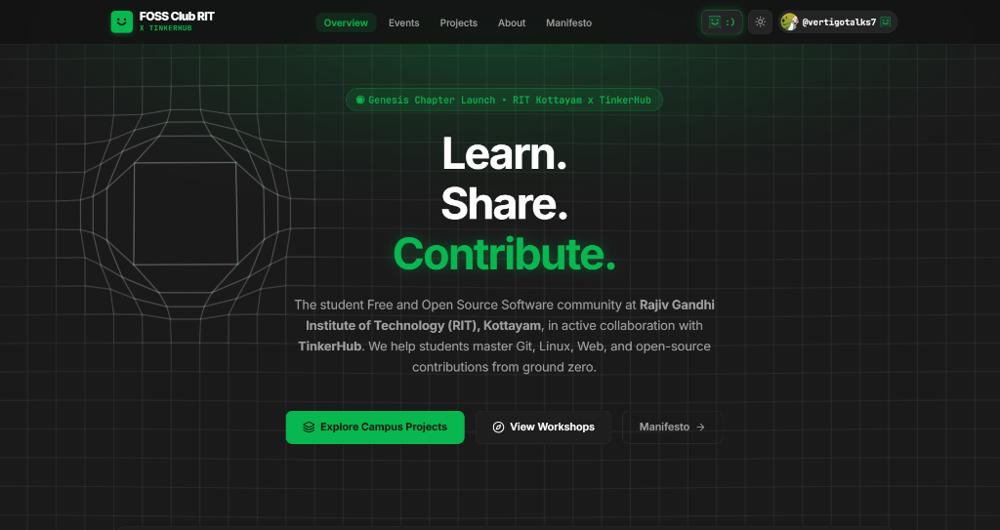

# FOSS Club — RIT Kottayam

The official community website for the Free and Open Source Software (FOSS) Club at Rajiv Gandhi Institute of Technology (RIT), Government Engineering College, Kottayam, in collaboration with the [TinkerHub Foundation](https://tinkerhub.org) (Campus Chapter 2160).

**Motto:** *Learn. Share. Contribute.*



---

## How to Feature Your Project (Step-by-Step Guide)

You do not need to install any programming language or tool on your computer. You only need a GitHub account to submit your open-source project.

### Step 1: Fork This Repository
1. Click the **Fork** button at the top right of this repository ([github.com/vertigotalks7/FOSS-RIT](https://github.com/vertigotalks7/FOSS-RIT)).
2. This creates your own copy of the project on your GitHub account.

### Step 2: Create a Markdown File for Your Project
1. In your forked repository, navigate into the `content/projects/` folder.
2. Click **Add file** -> **Create new file**.
3. Name your file using lowercase letters and hyphens (example: `smart-parking.md` or `ktu-cgpa-calculator.md`).
4. Copy and paste the template below, replacing the placeholder values with your project details:

```markdown
---
name: "Smart Campus Parking Radar"
description: "IoT sensor and computer vision system tracking real-time parking space occupancy at RIT."
repo_url: "https://github.com/your-username/smart-parking"
tech_stack: ["Python", "OpenCV", "React"]
author: "your-github-username"
author_name: "Your Full Name"
is_verified_student: true
batch: "2026"
featured: true
---

### About the Project
Write a short summary explaining what your project does, what problem it solves on campus, and how other students can run or contribute to it.
```

### Step 3: Submit a Pull Request
1. Scroll down and click **Commit changes...**.
2. Go to the **Pull requests** tab in your fork and click **New pull request**.
3. Click **Create pull request**, give it a clear title (e.g., `Add Smart Campus Parking Radar`), and submit.
4. An automated test will verify your file formatting and check that your repository link is reachable.
5. Once a maintainer merges your Pull Request, your project will automatically appear on the live website and you will be added to the campus contributor leaderboard.

---

## Submission Guidelines

To keep the campus showcase helpful and authentic:
- **Real Code:** The repository must contain working code and a basic `README.md` explaining how to run the project.
- **Open Source:** The repository must be public on GitHub.
- **Authenticity:** Submit your own projects or projects you actively contribute to. Please avoid submitting unmodified forks of existing projects.

---

## Campus Contributor Leaderboard & XP System

The platform tracks open-source engagement across campus repositories. XP is calculated automatically from repository metrics:

| Action / Milestone | XP Points | Description |
| :--- | :--- | :--- |
| **Campus Verified** | `+50 XP` | Verified `@rit.ac.in` student builder |
| **First Project** | `+100 XP` | First project featured on the campus radar |
| **Additional Projects** | `+75 XP` each | 2nd and 3rd featured projects |
| **Peer Forks** | `+20 XP` per fork | When someone forks or clones your repository |
| **GitHub Stars** | `+5 XP` per star | Capped at 100 XP per project to keep competition balanced |
| **Tech Versatility** | `+15 XP` per tech | Bonus for exploring multiple languages or frameworks |

### Contributor Levels:
- **Level 1 (0 – 99 XP):** *Script Tinkerer*
- **Level 2 (100 – 299 XP):** *Open Source Novice*
- **Level 3 (300 – 699 XP):** *Byte Craftsman*
- **Level 4 (700 – 1499 XP):** *Systems Architect*
- **Level 5 (1500+ XP):** *Kernel Overlord*

---

## License

This project is open-source under the [MIT License](https://opensource.org/licenses/MIT).

- **Institution:** [Rajiv Gandhi Institute of Technology (RIT), Kottayam](https://rit.ac.in)
- **Partner Community:** [TinkerHub Foundation](https://tinkerhub.org)
- **Created & Maintained by:** [@vertigotalks7](https://github.com/vertigotalks7)

