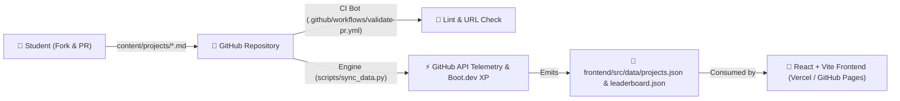

# FOSS Club — RIT Kottayam

The official web platform and community portal for the Free and Open Source Software (FOSS) Club at Rajiv Gandhi Institute of Technology (RIT), Government Engineering College, Kottayam — built in active collaboration with the [TinkerHub Foundation](https://tinkerhub.org) (Campus Chapter 2160).

**Motto:** *Learn. Share. Contribute.*


---

## 🌟 Overview & Pure GitOps Architecture

The platform operates on a **100% Pure GitOps / Flat-File Architecture**. There are **no external databases**, **no fragile connection strings**, and **no server-side user tables**. Everything is driven by standard markdown files, GitHub Pull Requests, and automated CI/CD workflows.



---

## 📂 Where is Data Referenced and Sourced?

For both beginners and core maintainers, here is the complete map of where data lives:

| Layer | File / Directory | Purpose |
| :--- | :--- | :--- |
| **1. Source of Truth** | [`content/projects/*.md`](file:///c:/PROJECTS/foss-club-website/content/projects/) | **Where humans write.** Every featured project has its own `.md` file with YAML frontmatter. |
| **2. Template** | [`content/projects/_template.md`](file:///c:/PROJECTS/foss-club-website/content/projects/_template.md) | Starter file for students to copy when submitting a new project. |
| **3. Telemetry Engine** | [`scripts/sync_data.py`](file:///c:/PROJECTS/foss-club-website/scripts/sync_data.py) | **Where data gets processed.** Parses markdown files, queries GitHub's REST API for live stars & forks, and computes the Boot.dev RPG XP rankings. |
| **4. Runtime Feeds** | [`frontend/src/data/projects.json`](file:///c:/PROJECTS/foss-club-website/frontend/src/data/projects.json)<br>[`frontend/src/data/leaderboard.json`](file:///c:/PROJECTS/foss-club-website/frontend/src/data/leaderboard.json) | **Where the website reads.** Pre-computed static JSON files bundled directly into the frontend build. |
| **5. Live Scraper** | [`backend/services/tinkerhub_service.py`](file:///c:/PROJECTS/foss-club-website/backend/services/tinkerhub_service.py) | In-memory live scraper for upcoming TinkerHub workshops and campus events. |

---

## 🚀 Contribution Guide

Whether you are a 1st-year student making your very first open-source Pull Request or an experienced engineer contributing features to the website, follow the appropriate guide below:

---

### Path A: Submit Your Campus Project (For Beginners & Students)

You do **not** need to install Python or Node.js to feature your project! You only need a GitHub account.

#### Step 1: Fork the Repository
Click the **Fork** button at the top right of [github.com/vertigotalks7/FOSS-RIT](https://github.com/vertigotalks7/FOSS-RIT).

#### Step 2: Create a Markdown File
In your fork, navigate to `content/projects/` and create a new file named `your-project-name.md` (e.g. `smart-parking.md`):

```markdown
---
name: "Smart Parking Radar"
description: "IoT parking slot availability radar for RIT mechanical & main block parking."
repo_url: "https://github.com/your-username/smart-parking"
tech_stack: ["Python", "FastAPI", "React", "ESP32"]
submitted_by_username: "your-github-username"
is_verified_student: true
batch: "2026"
featured: true
---

### About the Project
Detailed description of what you built, architecture diagram, and how other students can run it.
```

#### Step 3: Open a Pull Request
1. Submit a Pull Request from your fork to `main`.
2. Our automated bot ([`.github/workflows/validate-pr.yml`](file:///c:/PROJECTS/foss-club-website/.github/workflows/validate-pr.yml)) will instantly check your frontmatter syntax and verify your GitHub repository URL.
3. Once merged by a maintainer, your project will appear on the **Projects Radar** and your GitHub profile will earn XP on the **Leaderboard**!

---

### Path B: Develop on Core Website (For Developers & Maintainers)

#### 1. Prerequisites
- **Node.js**: v18.0+ ([nodejs.org](https://nodejs.org/))
- **Python**: 3.10+ ([python.org](https://www.python.org/))
- **Git**: ([git-scm.com](https://git-scm.com/))

#### 2. Local Setup

```bash
# Clone the repository
git clone https://github.com/vertigotalks7/FOSS-RIT.git
cd FOSS-RIT

# 1. Test Data Telemetry Sync
python scripts/sync_data.py

# 2. Start Frontend Dev Server
cd frontend
npm install
npm run dev
```
Open `http://localhost:3000` to view the live website with hot reloading.

#### 3. Run Automated Sync Manually
To fetch fresh star counts, forks, and re-calculate XP levels:
```bash
python scripts/sync_data.py
```
*(Optional: set `GITHUB_TOKEN=your_token` in your shell to avoid GitHub's 60 req/hr anonymous rate limit).*

---

## 🏆 Boot.dev RPG XP & Leveling Formula

The leaderboard runs a balanced RPG XP calculation engine designed to encourage beginner contributions while rewarding prolific open-source builders:

| Action / Milestone | XP Awarded | Description |
| :--- | :--- | :--- |
| **Campus Verified** | `+50 XP` | Verified `@rit.ac.in` student builder |
| **First Ship 🚀** | `+100 XP` | 1st project featured on the campus radar |
| **Trilogy 🔱** | `+75 XP` each | 2nd and 3rd featured projects |
| **Peer Fork 🍴** | `+20 XP` per fork | Another student cloned/forked your code |
| **GitHub Stars ⭐** | `+5 XP` per star | Capped at 100 XP per repo to prevent outlier distortion |
| **Polyglot ⚡** | `+15 XP` per tech | Multi-stack versatility bonus (up to 60 XP) |

### Developer Tiers:
- 🟢 **Level 1 (0 – 99 XP):** *Script Tinkerer*
- 🟢 **Level 2 (100 – 299 XP):** *Open Source Novice*
- 🔵 **Level 3 (300 – 699 XP):** *Byte Craftsman*
- 🟣 **Level 4 (700 – 1499 XP):** *Systems Architect*
- 🔴 **Level 5 (1500+ XP):** *Kernel Overlord*

---

## ⚙️ CI/CD GitHub Actions

- [`.github/workflows/validate-pr.yml`](file:///c:/PROJECTS/foss-club-website/.github/workflows/validate-pr.yml): Automated PR linter that checks Markdown syntax and validates repository URLs.
- [`.github/workflows/nightly-sync.yml`](file:///c:/PROJECTS/foss-club-website/.github/workflows/nightly-sync.yml): Scheduled cron job that automatically updates stars, forks, and leaderboard XP every midnight UTC.

---

## 📄 License

This project is open-source and released under the [MIT License](https://opensource.org/licenses/MIT).

- **Institution:** [Rajiv Gandhi Institute of Technology (RIT), Kottayam](https://rit.ac.in)
- **Partner Community:** [TinkerHub Foundation](https://tinkerhub.org)
